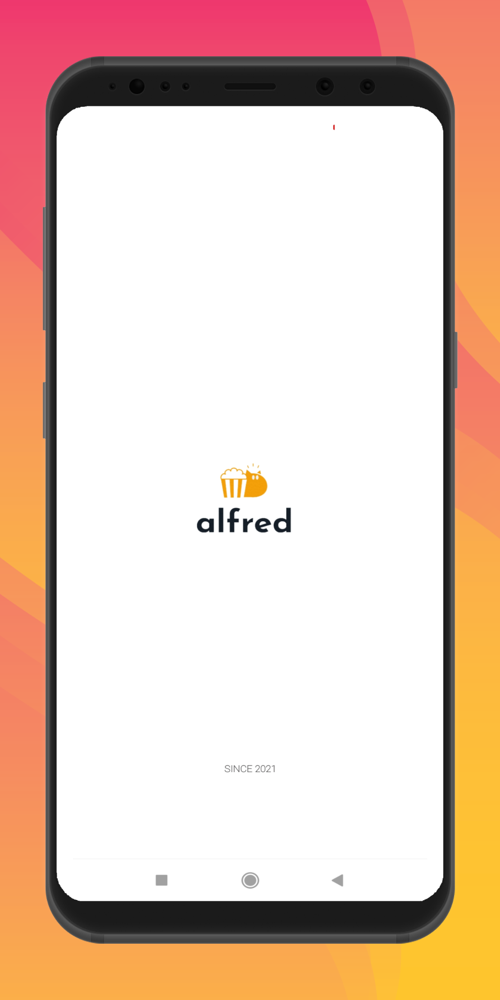

  

  <h3 align="center">Alfred</h3>

  

    Movies & TV Shows Review App
     

  

  
Table of Contents

  <ol>
    <li>
      <a href="#about-the-project">About The Project</a>
    </li>
    <li><a href="#more-details">More Details</a></li>
    <li><a href="#license">License</a></li>
    <li><a href="#contact">Contact</a></li>
    <li><a href="#acknowledgments">Acknowledgments</a></li>
  </ol>

<!-- ABOUT THE PROJECT -->
## About The Project

Do you like to watch movies online and spend a lot of time looking for something interesting? Then you should pay attention to the Alfred application. It will help you choose the best movies or series.

            

The movies that are collected here will last you a long time. The collection is updated with new films and recognized masterpieces of past years. Regardless of who you are – a fan of energetic action movies or a fan of youth series. The plenty of the catalog will make you forget about all the other ways of spending leisure time.

In this application, you will find many interesting movie reviews. Reviews are written by real users who have already watched the selected movie or series.

The choice of movies is very wide and diverse. So everyone will find something interesting for themselves, whatever their tastes. This is the golden classic of Hollywood and soulful French comedies.

In the application catalog you will find reviews of films of any genres:

• love

•	detective

•	action movie

•	western

•	fantasy

•	art house

•	comedy

•	films about the war

•	horror

•	thriller

•	documentaries

The app Alfred also provides reviews of short films, as well as TV shows. Are you interested in the most iconic films in a particular genre? The search system will help you navigate and find the necessary review.

<!-- MORE DETAILS -->
## More Details

Visit My Blog for more Details about the App.

<a href="https://hrkdev.blogspot.com/"></img></a>

<!-- LICENSE -->
## License

Distributed under the HrkDev License.

<!-- CONTACT -->
## Contact

Hritik - [@hrk_kenoff](https://www.instagram.com/hrk_kenoff/) - lit2020076@iiitl.ac.in

Project Link: [https://github.com/your_username/repo_name](https://github.com/your_username/repo_name)

